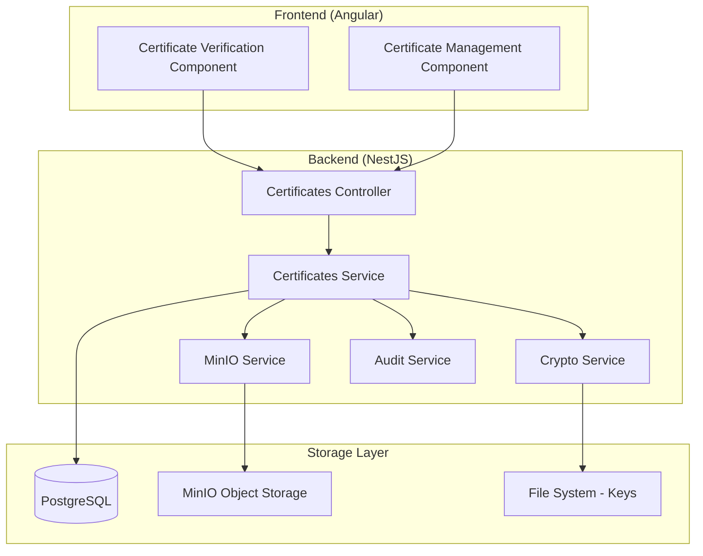

# Design Document

## Overview

The digital certificate system is designed as a comprehensive solution for generating, storing, and verifying course completion certificates using cryptographic signatures. The system integrates seamlessly with the existing NestJS backend architecture, leveraging established patterns and services including TypeORM entities, MinIO storage, audit logging, and JWT authentication.

The architecture follows a traditional three-tier approach with a presentation layer (Angular frontend), business logic layer (NestJS services), and data persistence layer (PostgreSQL + MinIO). Digital signatures ensure certificate authenticity without requiring blockchain technology, making the solution lightweight and cost-effective.

## Architecture

### High-Level Architecture



### Module Integration

The certificate system integrates with existing modules:

- **AuthModule**: Uses existing User entity and JWT authentication
- **CommonModule**: Leverages MinioService and AuditService
- **DatabaseModule**: Extends with Certificate entity using TypeORM
- **GuardsModule**: Uses existing JwtAuthGuard and RolesGuard

### Data Flow

1. **Certificate Generation**: Admin uploads certificate file → Service calculates hash → Signs with private key → Stores in MinIO + PostgreSQL
2. **Certificate Verification**: Public provides certificate ID → Service retrieves data → Recalculates hash → Verifies signature → Returns validation result
3. **Certificate Download**: Authenticated user requests download → Service validates ownership → Retrieves from MinIO → Returns file

## Components and Interfaces

### Database Schema

#### Certificate Entity
```typescript
@Entity('certificates')
export class Certificate {
  @PrimaryGeneratedColumn('uuid')
  id: string;

  @ManyToOne(() => User)
  @JoinColumn({ name: 'user_uuid' })
  user: User;

  @Column({ name: 'user_uuid', type: 'uuid' })
  user_uuid: string;

  @Column({ name: 'file_path', type: 'varchar', length: 500 })
  file_path: string;

  @Column({ name: 'hash', type: 'varchar', length: 64 })
  hash: string;

  @Column({ name: 'signature', type: 'text' })
  signature: string;

  @Column({ name: 'public_key_id', type: 'varchar', length: 100 })
  public_key_id: string;

  @Column({ name: 'course_name', type: 'varchar', length: 255 })
  course_name: string;

  @Column({ name: 'issued_date', type: 'timestamp' })
  issued_date: Date;

  @Column({ name: 'revoked', type: 'boolean', default: false })
  revoked: boolean;

  @Column({ name: 'revoked_at', type: 'timestamp', nullable: true })
  revoked_at: Date | null;

  @Column({ name: 'revoked_reason', type: 'text', nullable: true })
  revoked_reason: string | null;

  @CreateDateColumn({ name: 'created_at' })
  created_at: Date;

  @UpdateDateColumn({ name: 'updated_at' })
  updated_at: Date;
}
```

### Service Layer

#### CertificatesService
Core business logic for certificate operations:

```typescript
@Injectable()
export class CertificatesService {
  // Certificate generation
  async generateCertificate(userId: string, file: Express.Multer.File, courseName: string): Promise<ApiResponseDto<CertificateResponseDto>>
  
  // Certificate verification
  async verifyCertificate(certificateId: string): Promise<ApiResponseDto<VerificationResultDto>>
  
  // Certificate download
  async downloadCertificate(certificateId: string, userId: string): Promise<Buffer>
  
  // Certificate revocation
  async revokeCertificate(certificateId: string, reason: string): Promise<ApiResponseDto<void>>
  
  // List user certificates
  async getUserCertificates(userId: string): Promise<ApiResponseDto<CertificateResponseDto[]>>
}
```

#### CryptoService
Handles cryptographic operations:

```typescript
@Injectable()
export class CryptoService {
  // Hash calculation
  calculateSHA256(buffer: Buffer): string
  
  // Digital signature
  signHash(hash: string, privateKey: string): string
  
  // Signature verification
  verifySignature(hash: string, signature: string, publicKey: string): boolean
  
  // Key management
  loadPrivateKey(): string
  loadPublicKey(keyId: string): string
}
```

### Controller Layer

#### CertificatesController
RESTful API endpoints:

```typescript
@Controller('certificates')
export class CertificatesController {
  @Post()
  @UseGuards(JwtAuthGuard, RolesGuard)
  @Roles(UserRole.admin)
  async generateCertificate(@Body() dto: GenerateCertificateDto, @UploadedFile() file: Express.Multer.File)

  @Get(':id/verify')
  async verifyCertificate(@Param('id') id: string)

  @Get(':id/download')
  @UseGuards(JwtAuthGuard)
  async downloadCertificate(@Param('id') id: string, @Req() req: Request)

  @Post(':id/revoke')
  @UseGuards(JwtAuthGuard, RolesGuard)
  @Roles(UserRole.admin)
  async revokeCertificate(@Param('id') id: string, @Body() dto: RevokeCertificateDto)

  @Get('user/:userId')
  @UseGuards(JwtAuthGuard)
  async getUserCertificates(@Param('userId') userId: string, @Req() req: Request)
}
```

### Data Transfer Objects

#### GenerateCertificateDto
```typescript
export class GenerateCertificateDto {
  @IsUUID()
  @IsNotEmpty()
  user_uuid: string;

  @IsString()
  @IsNotEmpty()
  @MaxLength(255)
  course_name: string;

  @IsOptional()
  @IsString()
  @MaxLength(500)
  description?: string;
}
```

#### CertificateResponseDto
```typescript
export class CertificateResponseDto {
  id: string;
  user_uuid: string;
  user_email: string;
  course_name: string;
  issued_date: Date;
  file_path: string;
  public_key_id: string;
  revoked: boolean;
  created_at: Date;
}
```

#### VerificationResultDto
```typescript
export class VerificationResultDto {
  valid: boolean;
  certificate?: CertificateResponseDto;
  reason?: string;
  verified_at: Date;
}
```

## Data Models

### Certificate Storage Model

The certificate data is distributed across multiple storage systems:

1. **PostgreSQL (Metadata)**:
   - Certificate ID and relationships
   - Hash and signature values
   - User associations and timestamps
   - Revocation status and audit trail

2. **MinIO (File Storage)**:
   - Original certificate files (PDF/JSON)
   - Organized by date and user structure
   - Public read access for verification

3. **File System (Keys)**:
   - RSA/ECDSA private keys (secure storage)
   - Public keys with version identifiers
   - Key rotation and backup management

### File Organization

```
MinIO Bucket Structure:
certificates/
├── 2024/
│   ├── 01/
│   │   ├── user-uuid-1/
│   │   │   └── certificate-id.pdf
│   │   └── user-uuid-2/
│   │       └── certificate-id.pdf
│   └── 02/
└── 2025/

File System Keys:
keys/
├── private/
│   ├── rsa-2024-01.pem
│   └── rsa-2024-02.pem
└── public/
    ├── rsa-2024-01.pub
    └── rsa-2024-02.pub
```

## Error Handling

### Exception Hierarchy

The system uses NestJS built-in exceptions following existing patterns:

- **BadRequestException**: Invalid input data, malformed files
- **UnauthorizedException**: Missing or invalid authentication
- **ForbiddenException**: Insufficient permissions for operation
- **NotFoundException**: Certificate or user not found
- **ConflictException**: Duplicate certificate generation attempts
- **InternalServerErrorException**: Cryptographic or storage failures

### Error Response Format

All errors follow the existing ApiResponseDto pattern:

```typescript
{
  success: false,
  message: "Certificate not found",
  error: "CERTIFICATE_NOT_FOUND",
  statusCode: 404,
  timestamp: "2024-01-15T10:30:00.000Z"
}
```

### Rollback Strategy

For certificate generation failures:
1. Delete uploaded file from MinIO if database save fails
2. Remove database record if file upload fails after DB save
3. Log all rollback operations for audit trail
4. Return appropriate error response to client

## Testing Strategy

### Unit Testing

**Service Layer Tests**:
- Certificate generation with valid/invalid inputs
- Hash calculation and signature verification
- File upload and download operations
- Error handling and edge cases

**Controller Layer Tests**:
- Endpoint authentication and authorization
- Request validation and response formatting
- File upload handling and size limits
- Error response consistency

### Integration Testing

**Database Integration**:
- Certificate entity CRUD operations
- User relationship integrity
- Transaction rollback scenarios
- Audit log generation

**MinIO Integration**:
- File upload and download operations
- Bucket policy and access control
- File organization and naming
- Storage failure handling

**Cryptographic Integration**:
- Key loading and validation
- Signature generation and verification
- Hash calculation consistency
- Key rotation scenarios

### End-to-End Testing

**Certificate Lifecycle**:
1. Admin generates certificate for user
2. Certificate is stored and signed correctly
3. Public verification returns valid result
4. User can download their certificate
5. Admin can revoke certificate
6. Verification returns invalid after revocation

**Security Testing**:
- Unauthorized access attempts
- Invalid signature detection
- File tampering detection
- Key compromise scenarios

### Performance Testing

**Load Testing**:
- Concurrent certificate generation
- Bulk verification requests
- Large file upload handling
- Database query optimization

**Storage Testing**:
- MinIO throughput and latency
- Database connection pooling
- File system key access
- Memory usage optimization

## Security Considerations

### Cryptographic Security

**Key Management**:
- RSA 2048-bit or ECDSA P-256 minimum key sizes
- Secure key storage with proper file permissions (600)
- Key rotation strategy with overlapping validity periods
- Hardware Security Module (HSM) support for production

**Signature Algorithm**:
- RSA-PSS with SHA-256 for RSA keys
- ECDSA with SHA-256 for elliptic curve keys
- Deterministic signature generation
- Signature format standardization (Base64 encoding)

### Access Control

**Authentication**:
- JWT token validation for all protected endpoints
- Role-based access control for administrative functions
- User ownership validation for certificate access
- Session management integration

**Authorization Matrix**:
- Admin: Generate, revoke, view all certificates
- User: View and download own certificates only
- Public: Verify certificates without authentication
- System: Audit logging and monitoring

### Data Protection

**File Security**:
- Certificate files stored with restricted access
- MinIO bucket policies for public read access
- File integrity verification before serving
- Secure file deletion for revoked certificates

**Database Security**:
- Encrypted connections to PostgreSQL
- Parameterized queries to prevent SQL injection
- Audit logging for all certificate operations
- Regular backup and recovery procedures

### Audit and Monitoring

**Audit Events**:
- Certificate generation and revocation
- Verification attempts and results
- File access and download operations
- Administrative actions and changes

**Security Monitoring**:
- Failed verification attempts
- Unauthorized access attempts
- Unusual download patterns
- Key access and usage tracking

**Compliance**:
- GDPR compliance for user data handling
- Audit trail retention policies
- Data anonymization for analytics
- Regular security assessments